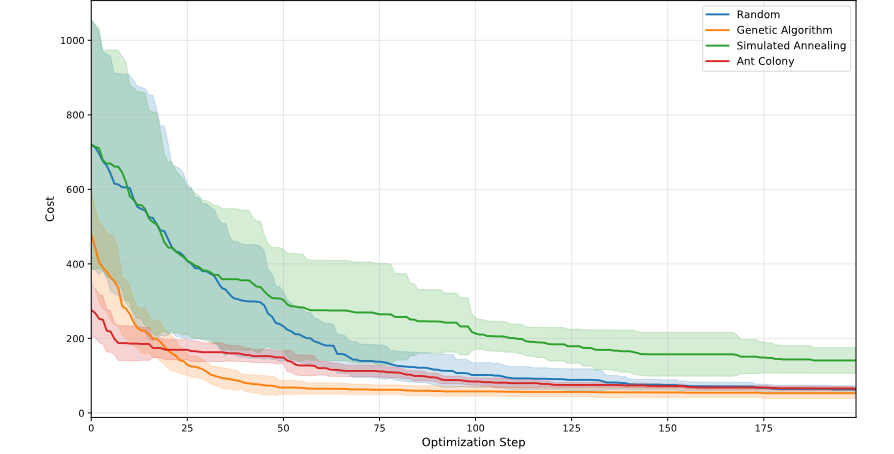
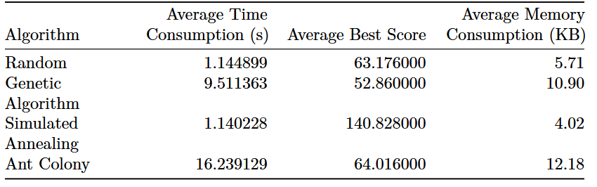
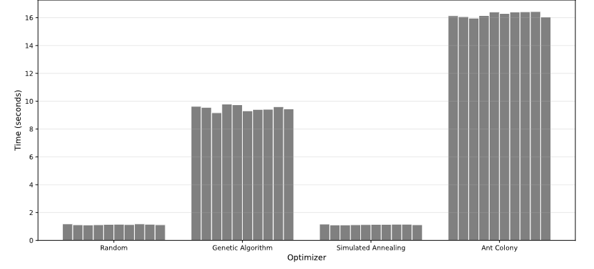
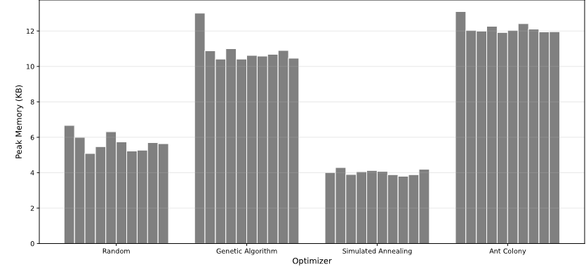

---
format:
  pdf:
    documentclass: article
    toc: false
    toc-depth: 2
    include-in-header:
      text: |
        \usepackage{geometry}
        \usepackage{titlesec}
        \usepackage{caption}

        \captionsetup{labelformat=empty,font=small}

        \titleformat{\section}
          {\centering\Huge\bfseries}
          {\thesection}
          {1em}
          {}

        \titleformat{\subsection}
          {\Large\bfseries}
          {\thesubsection}
          {1em}
          {}
editor: visual
---

<!-- LTeX: enabled=false -->

<!-- prettier-ignore-start -->

\thispagestyle{empty}  
\vspace*{\fill}  
\thispagestyle{empty}  
\vspace*{\fill}  
\begin{center}  

{\Large\bfseries PCR Primer Design: A Comparative Analysis of Random Search, Simulated Annealing, Genetic Algorithms, and Ant Colony Optimization}

\vspace{1.5cm}

by

\vspace{0.5cm}

{\large Benjamin Herzog, Alex Filo, Michael Ogar and Jamal Ajegunma}

\vspace{1.5cm}

Zurich University of Applied Sciences\\
Department of Applied Computational Life Sciences

\vspace{1.2cm}

\textit{Module: Optimization And Bio-inspired Algorithms}

\vspace{1.2cm}

Supervised by

\vspace{1.2cm}

Thomas Ott

Ahmad Aghaebrahimian

\vspace{1.5cm}

April 2026

\end{center}
\vspace*{\fill}
\newpage
\tableofcontents
\newpage
\newgeometry{top=1.5cm, bottom=1.5cm, left=1.5cm, right=1.5cm}

<!-- prettier-ignore-end -->

<!-- LTeX: enabled=true -->

<!-- LTeX: language=en-GB -->

# Introduction

Polymerase Chain Reaction (PCR) is a common laboratory technique to amplify specific regions of DNA. The first step in any PCR experiment is the selection of two primers, short oligonucleotide sequences of 18–25 bases drawn from the nucleotide alphabet $\{A, C, G, T\}$, which define the boundaries of the amplified region. The composition and order of these primers directly determines their thermodynamic and structural properties such as binding specificity, annealing efficiency, and susceptibility to hairpin formations and primer-dimer interactions.

Selecting an optimal primer pair can be framed as a minimization problem: find the two sequences that minimize a cost function encoding thermodynamic and structural quality, subject to the constraint that each sequence is drawn from a four-letter alphabet of fixed length. For a fixed primer length of $L=25$, where each position can take one of four nucleotide states, the search space for a primer pair $p_1, p_2$ is:

$$
S = \{(p_1, p_2) \mid p_1, p_2 \in \{A, C, G, T\}^{25} \}, \quad |S| = 4^{50}
$$

Exhaustive evaluation of $4^{50}$ candidate pairs is computationally infeasible, motivating the use of optimization methods. Primer design has previously been formulated as an optimization problem and tackled with genetic algorithms (Wu et al., 2007), simulated annealing (Montera and Nicoletti, 2008), and ant colony optimization (Wang et al., 2023). However, these studies each focus on a single method. This project provides a direct comparison of all three approaches alongside a random search baseline, evaluated on a fixed computational budget. We define a cost function that penalizes undesirable primer properties. The objective is to find the primer pair that minimizes this cost function. Four optimization algorithms (Random Search, Simulated Annealing, Genetic Algorithm, and Ant Colony Optimization) are implemented and compared with respect to solution quality, computational efficiency, and robustness.

# Cost Function and Parameters

The application minimizes the total cost of a primer pair $(p_1, p_2)$. The cost function consists of five parts:

$$
C(p_1,p_2)=C_T + C_{GC} + C_R + C_H + C_D
$$

The five different parts, briefly explained, are:

1.  $C_T$: penalizes melting temperatures far from the target and penalizes mismatch between the two primers' melting temperatures.
2.  $C_{GC}$: penalizes deviation of each primer's GC fraction from the target.
3.  $C_R$: penalizes long homopolymer runs (repeats).
4.  $C_H$: penalizes hairpin-forming potential using each sequence's hairpin score.
5.  $C_D$: penalizes primer-dimer risk from complementary runs between the two primers (especially near sequence ends).

They are calculated as such:

$$
\begin{aligned}
C_T &= w_{Tt}\!\left[(T^*-T_m(p_1))^2 + (T^*-T_m(p_2))^2\right]
      + w_{Tb}\!\left[T_m(p_1)-T_m(p_2)\right]^2,\\
C_{GC} &= w_{GC}\!\left[(G^*-GC(p_1))^2 + (G^*-GC(p_2))^2\right],\\
C_R &= w_R\!\left(\mathbf{1}[R(p_1)>r_0]\cdot R(p_1)+\mathbf{1}[R(p_2)>r_0]\cdot R(p_2)\right),\\
C_H &= w_H\!\left(H(p_1)+H(p_2)\right),\\
C_D &= w_D\cdot D(p_1,p_2).
\end{aligned}
$$

with:

| Symbol        | Meaning                                               |
|---------------|-------------------------------------------------------|
| $GC(p)$       | Calculate GC content of a sequence $p$                |
| $T_m(p)$      | Calculate melting temperature of a sequence $p$       |
| $R(p)$        | Get the longest repeat in a sequence $p$              |
| $r_0$         | Minimum length of a repeat to affect the cost (3)     |
| $H(p)$        | Calculate the hairpin score of sequence $p$           |
| $D(p_1, p_2)$ | Calculate the dimer score of sequence $p_1$ and $p_2$ |
| $T^*$         | Target temperature (60°C)                             |
| $G^*$         | Target GC content (0.5)                               |

The symbols starting with $w$ stand for weights, which normalize the different score magnitudes and encode the relative importance of each criterion. The weights used in this project are:

| Weight   | Value | Description                               |
|----------|-------|-------------------------------------------|
| $w_{Tt}$ | 1     | Tm deviation from target                  |
| $w_{Tb}$ | 2     | Tm mismatch between primers               |
| $w_{GC}$ | 50    | GC content deviation                      |
| $w_R$    | 10    | Homopolymer repeats (threshold $r_0 = 3$) |
| $w_H$    | 5     | Hairpin self-complementarity              |
| $w_D$    | 8     | Primer-dimer 3' complementarity           |

The GC content weight is highest because the raw $(GC - 0.5)^2$ term produces very small values (fractions squared) and must be rescaled to be comparable to the temperature terms, which are already in units of $^{\circ}\text{C}^2$. Among the structural penalties, dimer is weighted above hairpin because dimer formation wastes both primers simultaneously, while a hairpin only affects one.

# Optimization Algorithms

## Random Search Optimizer

The random search optimizer has been implemented to serve as a baseline to compare the other algorithms to. It randomly changes a nucleotide and adopts the change as long as it does not negatively impact the cost.

## Genetic Algorithm Optimizer

Genetic algorithm (GA) is a search technique that mimics natural selection to find optimal solutions by iteratively refining a population of candidate solutions (Mckee, 2024). In this study it is used to optimize PCR primer pairs, where each individual represents a primer pair $(p_1, p_2)$ of fixed length $L=25$ over $\{A,C,G,T\}$.

The population is initialized with randomly generated primer pairs and each individual is evaluated using the defined primer cost function, where lower values indicate better solutions.

At each generation, tournament selection is used to select parent primer pairs based on fitness. Selected parents are randomly paired, and single point crossover is applied to both forward and reverse primers, exchanging nucleotide segments to generate offspring.'

Mutation is performed by randomly altering each nucleotide with a probability 1/ $L$ per position, following the standard heuristic proposed by Ochoa (2002), introducing diversity and enabling exploration of the search space.

Elitism is implemented by replacing the worst individual in the new population with the best solution found so far, ensuring that high quality primer pairs are preserved. This process is repeated for a fixed number of generations, and the final output is the primer pair with the minimum cost.

## Simulated Annealing Optimizer

Simulated Annealing (SA) is an optimization method inspired by the physical process of slowly cooling molten material into a crystalline state, allowing the search to escape local minima by probabilistically accepting worse solutions early in the process (Kirkpatrick et al., 1983). In this problem, the approach follows a similar framework; each state is defined as a pair of two 25-base strings, and each neighbour state is generated by randomly selecting one of the 50 possible bases to switch to one of the three possible base values.

When the neighbour state leads to a decrease in the cost function the move is always accepted; otherwise it is accepted with probability $\exp(-\Delta C / T)$ where $\Delta C$ is the cost difference and $T$ is the current temperature. This project used a geometric cooling schedule defined by $T_{k+1} = \alpha \cdot T_k$ with an initial temperature $T_0 = 100$ and $\alpha = 0.995$, and the algorithm ran 1,000 times.

## Ant Colony Optimizer

Ant Colony Optimization is a method inspired by how ants find short paths using pheromone trails (Dorigo et al., 1996). In this implementation, each ant builds a candidate solution representing a primer pair $(p_1, p_2)$, where the goal is to minimize the primer quality cost function. The algorithm starts with equal pheromone values. At each iteration, ants create primer pairs by making random choices guided by these pheromone values, where better solutions are more likely to be selected. Each solution is evaluated using the primer quality cost function. After all ants have built their solutions, pheromone values are increased for better primer pairs, while all values are slightly reduced to keep the search diverse. This process is repeated for a fixed number of iterations while tracking the best solution found. The final output is the primer pair with the minimum cost.

The pheromone matrix $\tau$ of shape $(2 \times L \times 4)$ is initialized uniformly to 1, and the probability of selecting each nucleotide is proportional to $\tau^{\alpha}$ with $\alpha = 1.0$. After each iteration, pheromones are evaporated by factor $(1 - \rho)$ with $\rho = 0.1$, and each of the 10 ants deposits $Q/C$ on its selected nucleotides, where $Q = 1.0$ and $C$ is the solution cost.

## Results and Comparison of Algorithm based on Benchmark and Visualization

Four optimization algorithms were evaluated, Random Search, Simulated Annealing (SA), Genetic Algorithm (GA), and Ant Colony Optimization (ACO) under two experimental settings: randomly varying problem instances and a fixed problem instance. Performance is reported in terms of mean best cost, runtime, and memory usage over 20 runs and 200 iterations.

As shown in Figure 1 (Final cost line plot), the Genetic Algorithm achieved the lowest average final cost of approximately 53, followed by Random Search and Ant Colony Optimization at 63 and 64 respectively, while Simulated Annealing performed notably worse at approximately 141. SA's poor performance is attributable to premature convergence: the cooling rate of $\alpha=0.995$ was too aggressive for a search space of this size, causing the acceptance probability for uphill moves to decay before the algorithm could escape local minima. Adjusting to $\alpha=0.999$ and increasing the mutations per step from 1 to 4 would likely yield better results. Regarding robustness, GA, ACO, and Random Search produced consistent results across multiple runs with different seeds, while SA varies much more, reflecting the stochastic nature of which local minimum it became trapped in.

::: {#fig-convergence}
{width="60%"}

**Figure 1:** Convergence of objective cost over iterations (mean ± std).\
Shows average cost progression with variability across runs, indicating convergence speed and stability of each optimizer.
:::

All four algorithms were compared using the same budget of 200 steps. Under this constraint, SA required significantly less memory (4.02 KB) and time (\~1.1s) than GA (10.90 KB, \~9.5s), suggesting that giving SA a proportionally larger step budget could close the accuracy gap. This is also reflected in Table 1 (Performance comparison table), which summarizes runtime, memory usage, and final cost across all algorithms.

::: {#fig-table}
{width="60%"}

**Table 1:** Comparison of optimization algorithms.\
Reports mean ± standard deviation of runtime, peak memory usage, and final cost over multiple runs for each algorithm.
:::

In terms of computational efficiency, Figure 2 (Runtime histogram) shows that SA is consistently the fastest algorithm, while GA is the most computationally expensive, with ACO and Random Search in between. Similarly.

::: {#fig-runtime}
{width="60%"}

**Figure 2:** Runtime comparison across optimization algorithms over multiple runs.\
Shows mean execution time with variability, highlighting differences in computational efficiency and stability between methods.
:::

Figure 3 (Memory usage histogram) shows SA has the lowest memory consumption, followed by Random Search, with GA and ACO requiring more resources overall.

::: {#fig-memory}
{width="60%"}

**Figure 3:** Memory usage distribution across optimization algorithms.\
Shows peak memory consumption per run, allowing comparison of resource efficiency and variability between methods.
:::

## Discussion and Conclusion

Of the methods tested, the Genetic Algorithm is recommended for this problem due to its superior accuracy and robustness, despite higher computational cost. Its population-based search appears better suited to the mixed cost landscape, where Tm and GC terms vary smoothly but dimer terms create sharp discontinuities. By contrast, SA's single-solution trajectory makes it vulnerable to premature convergence though its low resource consumption suggests it could be competitive with a larger step budget or a more gradual cooling schedule. Notably, Random Search performed comparably to ACO despite having no intelligent search mechanism, which may indicate that ACO's pheromone model requires further tuning or a larger colony size to fully exploit its construction-graph approach for this problem. Future work could extend this project by optimizing primers against a fixed template sequence, incorporating variable primer length, and more systematically tuning each algorithm's hyperparameters. \newpage

# Appendix

## References

Asif, S., Khan, M., Arshad, M.W. and Shabbir, M.I., 2021. PCR optimization for beginners: A step by step guide. Research in Molecular Medicine, 9(2), pp.81–102.

Chuang, L.Y., Cheng, Y.H. and Yang, C.H., 2013. Specific primer design for the polymerase chain reaction. *Biotechnology Letters*, 35(10), pp.1541–1549.

Dorigo, M., Maniezzo, V. and Colorni, A., 1996. Ant system: optimization by a colony of cooperating agents. IEEE Transactions on Systems, Man, and Cybernetics, Part B, 26(1), pp.29–41.

Kirkpatrick, S., Gelatt, C.D. and Vecchi, M.P., 1983. Optimization by simulated annealing. Science, 220(4598), pp.671–680.

McKee, A., 2024. *Genetic algorithm: Complete guide with Python implementation*. Available at <https://www.datacamp.com> (Accessed: 7 April 2026).

Montera, L.C. and Nicoletti, M.C., 2008. A customized simulated annealing suitable for primer design in polymerase chain reaction processes. In: Bentley, P.J., Lee, D. and Jung, S. (eds.) Computational Intelligence in Biomedicine and Bioinformatics. Berlin: Springer, pp.221–241.

Ochoa, G., 2002. *Setting the mutation rate: Scope and limitations of the 1/L heuristic*. In: *Proceedings of the Genetic and Evolutionary Computation Conference (GECCO 2002)*. San Francisco: Morgan Kaufmann, pp.315–322.

Wang, X., Ning, J., Jiang, Y., Liu, R., Zhang, X. and Wu, J., 2023. A degenerate primer design method based on ant colony optimization. Discrete Dynamics in Nature and Society, 2023, pp.1–10.

Wu, L.C., Horng, J.T., Huang, H.Y., Chiang, Y.H., Huang, H.D. and Yang, C.H., 2007. Primer design for multiplex PCR using a genetic algorithm. Soft Computing, 11(9), pp.855–863.

## Source Code

The source code can be found in our git repository: <https://github.com/BeniTheDuke/PCR_Optimization>. The implementation with all the required classes are in the `src` folder. The visualizations for the comparison were generated with `/optimizer_comparison.qmd`.
